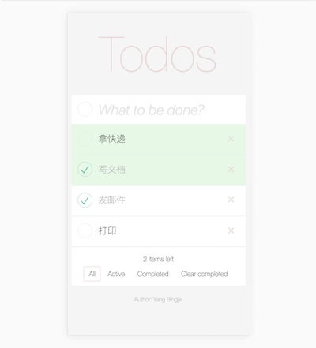
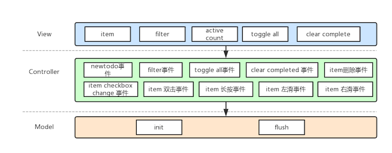
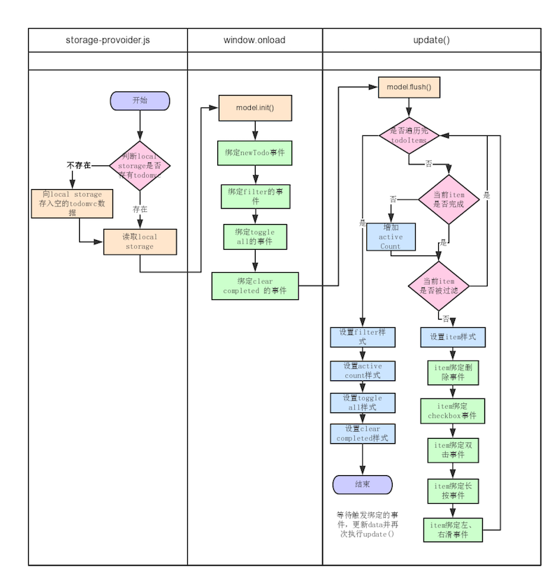

#  手机端 Todo List


[TOC]

### 基本功能

1. 新增、删除、展现列表，全部完成 / 取消、删除已完成
2. localStorage保存页面状态，刷新页面后可恢复

### 高级功能

1. 过滤

2. 双击编辑单条 todo

3. **长按置顶 / 取消置顶**

   添加原因：更改item顺序、强调重点

4. **左滑完成，右滑取消完成**

   添加原因：checkbox在左边，真机测试时右手不便操作

### 页面样式



### 目录结构

#### 主要文件

- index.html
- style.css
- index.js

#### 数据提供

- model.js**(开源代码，部分修改)**
- storage-provoider.js**(开源代码)**

#### 其他文件

- zepto.js**(开源代码)**
- package.js**(真机调试所用的代码)**
- express.js**(真机调试所用的代码)**

### 架构模式

#### MVC架构模式

- Model 层：使用 localStorage 实现 model 中的init(), flush()
- View 层：update()根据数据改变页面样式
- Controller 层：各种绑定的事件，用于响应用户在对 todo list 进行增删改等各种请求



### 主要流程



### 设计思路

使用MVC架构模式，使数据与表现分离，Controller只操作数据，然后触发update()，不直接改变样式

### 测试

- Mac Chrome 移动端模拟工具
- iPhone Safari
- Android Chrome

### 移动端处理

- 解决click延迟：使用zepto.js的tab event

- localstorage.setItem("变量名",值)，**变量名需要用小写**，移动端会把大写转小写，导致无法取到值

- 真机测试使用express框架

  ```
  npm install
  ```

- Safari默认样式、事件：outline样式、input margin、双击缩放、长按弹出菜单&文本选择等等
